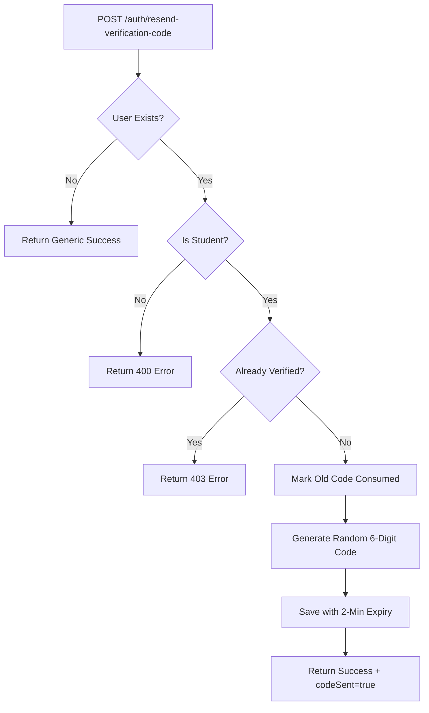

# Resend Verification Code - Quick Implementation Guide

## TL;DR - What We're Building

**Endpoint**: `POST /auth/resend-verification-code`  
**Purpose**: Let unverified students get a new 6-digit verification code  
**Key Change**: New random code (not sequential registration number)

---

## Quick Facts

| Aspect | Details |
|--------|---------|
| **Controller** | NEW `AuthController` at `/auth` |
| **Code Format** | 6-digit random (e.g., "384756") |
| **Expiration** | 2 minutes (same as registration) |
| **Security** | Generic response if user not found |
| **Old Codes** | Marked as consumed |
| **Response Format** | Nested: `{success: true, data: {...}}` |

---

## Implementation Order

### 1️⃣ DTOs (10 min)
```java
// ResendVerificationCodeRequest.java - Simple email field
// ResendVerificationCodeResponse.java - Nested success/data structure
```

### 2️⃣ Exception (5 min)
```java
// UserAlreadyVerifiedException.java - New exception
// GlobalExceptionHandler.java - Add handler method
```

### 3️⃣ Service (30 min)
```java
// UserService.java - Add method signature
// UserServiceImpl.java - Implement logic:
//   1. Find user by email
//   2. Validate student + unverified
//   3. Mark old code consumed
//   4. Generate 6-digit random code
//   5. Save new code with 2-min expiry
//   6. Return success response
```

### 4️⃣ Controller (10 min)
```java
// AuthController.java - New controller at /auth
// Single endpoint: POST /resend-verification-code
```

### 5️⃣ Tests (60 min)
```java
// AuthControllerIntegrationTest.java - Full integration tests
// UserServiceImplTest.java - Add unit tests for new method
```

**Total Estimate**: ~2 hours

---

## Key Design Decisions

### ✅ Why New `AuthController`?
- Public auth operations (not student-specific)
- Future endpoints: login confirmation, email verification
- Clean separation from internal auth (`/internal/auth`)

### ✅ Why Nested Response?
- Matches requirement specification exactly
- Standard API envelope pattern
- `success` flag for easy client handling

### ✅ Why Random Codes?
- Registration numbers are sequential (predictable)
- Random codes more secure
- Still 6 digits for easy typing

### ✅ Why Generic Response?
- Security: Don't reveal if email exists
- Same pattern as password reset
- Returns error only if already verified (acceptable)

---

## Business Logic Flow



---

## Code Snippets

### Generate 6-Digit Code
```java
SecureRandom secureRandom = new SecureRandom();
String code = String.format("%06d", secureRandom.nextInt(1000000));
```

### Mark Old Code Consumed
```java
verificationCodeRepository.findLatestActiveByUserIdAndType(
    user.getId(), VerificationType.REGISTRATION, Instant.now()
).ifPresent(oldCode -> {
    oldCode.markAsConsumed();
    verificationCodeRepository.save(oldCode);
});
```

### Create New Code
```java
VerificationCode verificationCode = VerificationCode.builder()
    .userId(user.getId())
    .code(newCode)
    .type(VerificationType.REGISTRATION)
    .expiresAt(Instant.now().plus(Duration.ofMinutes(2)))
    .retryCount(0)
    .build();
```

---

## Testing Scenarios

| Scenario | Expected Result |
|----------|----------------|
| Unverified student resends | ✅ 200 + new code created |
| Already verified user | ❌ 403 USER_ALREADY_VERIFIED |
| Non-existent email | ✅ 200 generic success |
| Admin user resends | ❌ 400 INVALID_ARGUMENT |
| Multiple resends | ✅ Each invalidates previous |
| Invalid email format | ❌ 400 VALIDATION_ERROR |

---

## Sample Requests & Responses

### Successful Resend
```bash
curl -X POST http://localhost:8080/userservice/auth/resend-verification-code \
  -H "Content-Type: application/json" \
  -d '{"email": "student@example.com"}'
```

```json
{
  "success": true,
  "data": {
    "message": "Verification code has been resent to your email",
    "codeSent": true
  }
}
```

### Already Verified
```json
{
  "code": "USER_ALREADY_VERIFIED",
  "message": "User account is already verified"
}
```

### Generic Success (Security)
```json
{
  "success": true,
  "data": {
    "message": "If the email exists and is unverified, a verification code has been sent",
    "codeSent": false
  }
}
```

---

## Checklist

### Files to Create
- [ ] `dto/ResendVerificationCodeRequest.java`
- [ ] `dto/ResendVerificationCodeResponse.java`
- [ ] `exception/UserAlreadyVerifiedException.java`
- [ ] `controller/AuthController.java`
- [ ] `test/.../AuthControllerIntegrationTest.java`

### Files to Modify
- [ ] `exception/GlobalExceptionHandler.java`
- [ ] `service/UserService.java`
- [ ] `service/impl/UserServiceImpl.java`
- [ ] `test/.../UserServiceImplTest.java`

### Validation
- [ ] All tests pass
- [ ] Manual test with Postman
- [ ] Check logs for proper INFO/WARN levels
- [ ] Verify old code marked consumed
- [ ] Verify new code expires in 2 minutes

---

## Common Pitfalls to Avoid

❌ **Don't** reveal if user exists in error message  
✅ **Do** return generic success for security

❌ **Don't** reuse registration number as resend code  
✅ **Do** generate new random 6-digit code

❌ **Don't** forget to mark old code as consumed  
✅ **Do** explicitly set `consumedAt` timestamp

❌ **Don't** use `java.util.Random`  
✅ **Do** use `java.security.SecureRandom`

❌ **Don't** forget `@Transactional` on service method  
✅ **Do** add annotation for database consistency

---

## Next Steps After Implementation

1. **Integration with BFF**
   - Update BFF to call new endpoint
   - Add email sending logic
   - Update frontend to show resend button

2. **Monitoring**
   - Track resend request volume
   - Monitor verification success rate
   - Look for abuse patterns

3. **Future Enhancements**
   - Rate limiting (max 5/hour)
   - SMS fallback option
   - Analytics dashboard

---

## Questions?

Refer to:
- **Full Plan**: `RESEND_VERIFICATION_CODE_PLAN.md`
- **Existing Code**: `UserServiceImpl.registerStudent()` for pattern
- **Similar Feature**: `UserServiceImpl.requestPasswordReset()` for security pattern

**Status**: Ready to implement 🚀

